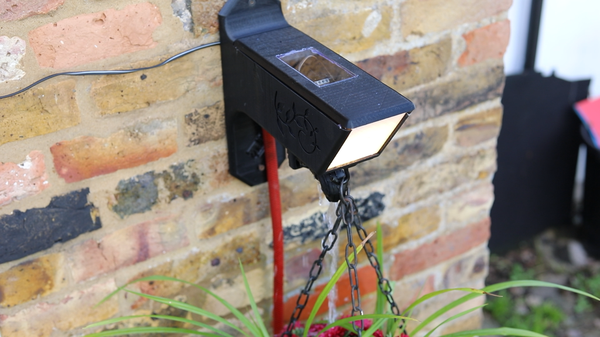

# [T3chFlicks](https://t3chflicks.org): Smart Hanging Basket

> an Arduino based weather station, built with hanging basket attachment and features include automated watering.

🎖️ Featured by [Distrelec](https://www.distrelec.de/en/knowhow-on-the-pulse/cms/t3ch-flicks-smart-hanging-basket)

🎖️ Featured by [Instructables](https://www.instructables.com/Smart-Buoy/)

🎖️ Featured by [Arduino](https://www.facebook.com/official.arduino/posts/3634356023257357)

---

## `tutorial`

 

---

## 💡 Product Showcase
> 
* Internet Controllable
* Weather Sensor
  * Illuminance
  * IR index
  * Air Temperature
  * Air Humidity
* Controls
  * Water flow
  * Flood light

---

This project was created by [T3chFlicks](https://t3chflicks.org) - A tech focused education and services company.

---